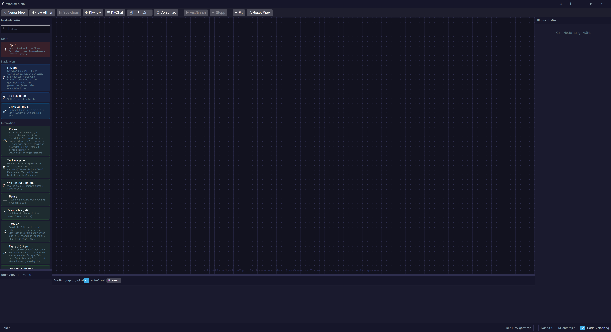
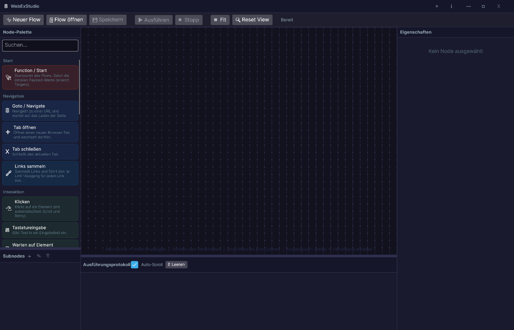
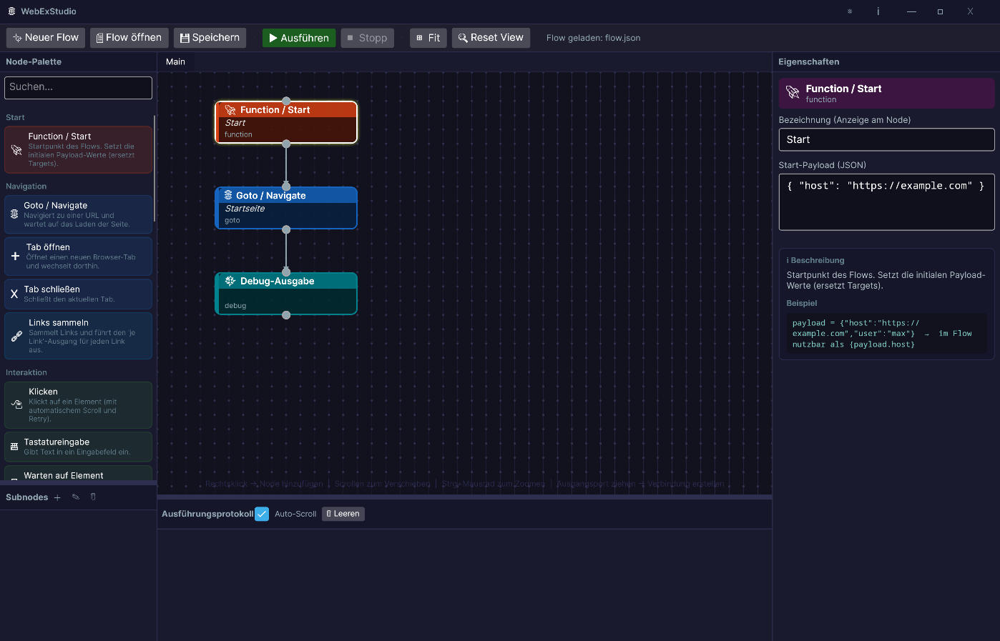
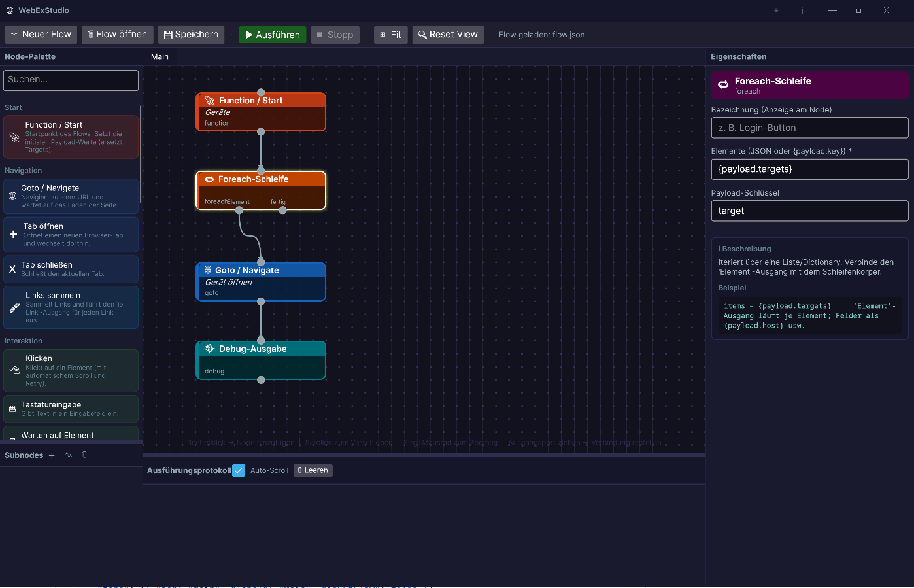
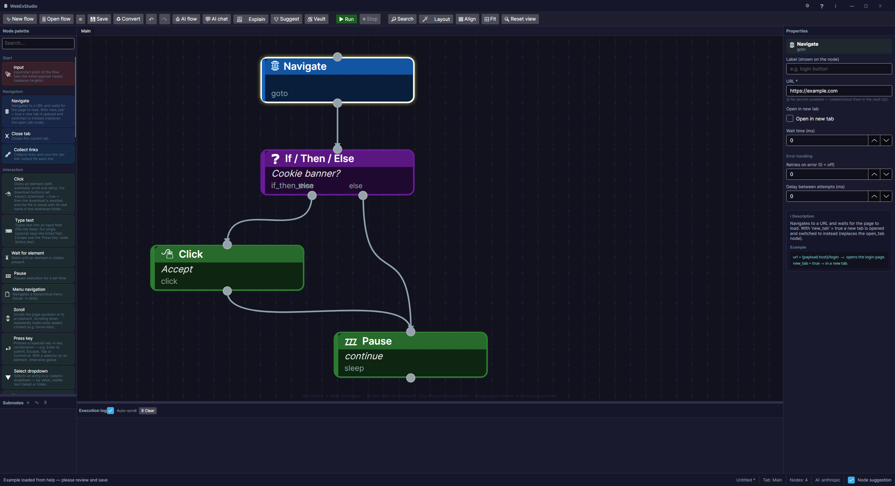
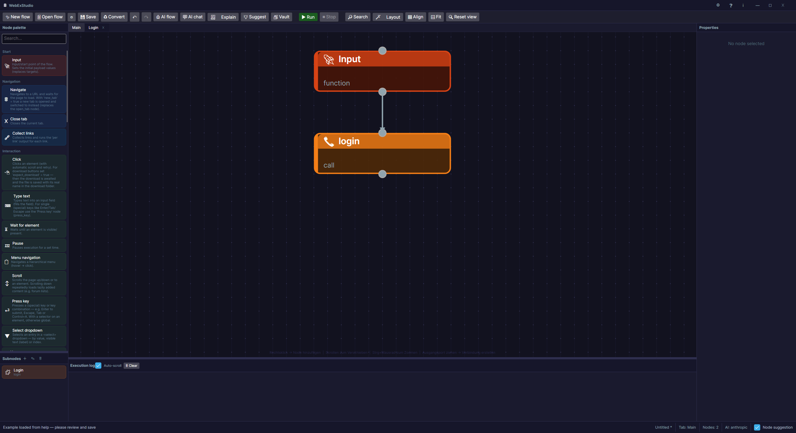
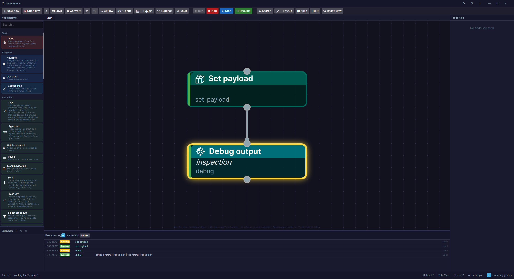
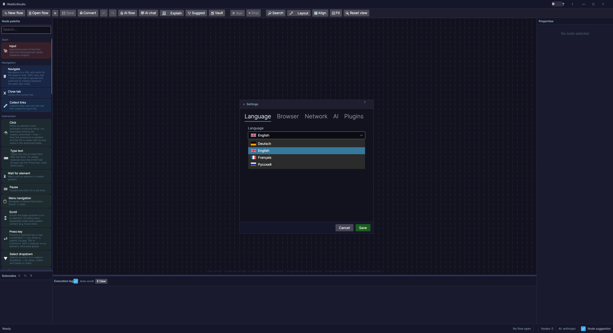

# WebExStudio

**Visuelle Desktop-App zum Erstellen und Ausführen von Web-Automatisierungen** — Browser-Abläufe werden als Node-Graph modelliert (im Stil von Node-RED) und direkt per [Playwright](https://playwright.dev/dotnet/) ausgeführt. Oberfläche: [Avalonia UI](https://avaloniaui.net/).

> **Screenshots:** Die Bilder liegen unter [`docs/images/`](docs/images). Falls dort noch Platzhalter stehen, einfach echte PNGs mit den genannten Dateinamen ablegen — die README bindet sie automatisch ein. Zusätzlich gibt es zu jedem Bereich eine ASCII-Skizze, damit alles auch ohne Bilder verständlich ist.



---

## Inhalt

- [Was kann WebExStudio?](#was-kann-webexstudio)
- [Schnellstart](#schnellstart)
- [Die Oberfläche](#die-oberfläche)
- [Kernkonzepte](#kernkonzepte)
- [Bedienung (Maus & Tastatur)](#bedienung-maus--tastatur)
- [Node-Referenz](#node-referenz)
- [Beispiele](#beispiele)
- [Payload & Platzhalter](#payload--platzhalter)
- [Einstellungen (Browser / Netzwerk / KI)](#einstellungen)
- [Logging](#logging)
- [KI: Flow aus Beschreibung](#ki-flow-aus-beschreibung)
- [Legacy-Projekte importieren](#legacy-projekte-importieren)
- [Dateiformat (v2)](#dateiformat-v2)
- [Flow-Validierung](#flow-validierung)
- [Tests & Continuous Integration](#tests--continuous-integration)
- [Projektstruktur](#projektstruktur)

---

## Was kann WebExStudio?

- **Visueller Flow-Editor**: Nodes per Drag & Drop platzieren, mit Wires (Verbindungen) verknüpfen.
- **Echte Verzweigungen & Schleifen**: `if`/`foreach`/`for_range`/`get_links` haben echte Ausgangs-Ports (z. B. `then`/`else`) — der komplette Ablauf ist sichtbar verdrahtet, nichts ist in versteckten Tabs.
- **Subnodes**: wiederverwendbare, benannte Unterprogramme (wie Funktionen), per `call`-Node aufgerufen.
- **Payload-Datenfluss**: ein gemeinsames Datenobjekt fließt durch den Flow; Platzhalter `{key}` / `{payload.key}` werden überall eingesetzt.
- **Live-Ausführung**: Während des Laufs folgt die Ansicht automatisch dem aktiven Node (auch in Subnodes hinein) und hebt ihn hervor.
- **Debug-Node mit Pause**: Payload im Protokoll anzeigen und den Flow optional anhalten, um nachzusehen.
- **Eigene Beschriftungen**: jeder Node bekommt einen frei wählbaren Anzeigenamen; dazu reine Kommentar-/Überschrift-Nodes (`label`/`caption`).
- **Browser frei wählbar**: Chromium/Firefox/WebKit, System-Browser (Chrome/Edge), eigener Programm- und Treiberpfad.
- **Legacy-Import**: alte Python-WebEX-Projekte (verschachtelte `actions/*.json`) werden in ein einziges v2-Flow konvertiert.

---

## Schnellstart

### Voraussetzungen

- [.NET 10 SDK](https://dotnet.microsoft.com/download)
- Playwright-Browser (einmalig installieren, siehe unten)

### Starten

```bash
dotnet run --project WebExStudio.UI
```

### Playwright-Browser installieren (einmalig)

```bash
dotnet build WebExStudio.Engine
pwsh WebExStudio.Engine/bin/Debug/net10.0/playwright.ps1 install
```

Alternativ kann in den [Einstellungen](#browser-einstellungen) ein bereits installierter System-Browser (z. B. Google Chrome) verwendet werden.

### Bauen

```bash
dotnet build          # gesamte Solution (WebExStudio.slnx)
```

---

## Die Oberfläche



```
┌──────────────────────────────────────────────────────────────────────────────┐
│  🌐 WebExStudio                                              ⚙  ℹ  —  ▢  ✕     │  ← Titelleiste (eigene Buttons)
├──────────────────────────────────────────────────────────────────────────────┤
│ ✨ Neuer Flow  📄 Flow öffnen  💾 Speichern │ ▶ Ausführen ⏹ Stopp ⏸ Pause 👣 Schritt ⏭ Weiter │ ⊞ Fit 🔍 Reset │ ← Toolbar
├───────────────┬──────────────────────────────────────────────┬───────────────┤
│ Node-Palette  │  [ Main ] [ login ✕ ] [ submit ✕ ]           │ Eigenschaften │
│  Suchen…      │                                              │               │
│  ▸ Start      │     ┌───────────────┐                        │ Bezeichnung   │
│  ▸ Navigation │     │ 🚀 Function    │                        │ [__________]  │
│  ▸ Interaktion│     └──────●────────┘                        │ Feld 1 …      │
│  ▸ …          │            │  (Wire)                          │ Feld 2 …      │
│───────────────│     ┌──────●────────┐                        │               │
│ Subnodes      │     │ 🌐 Goto        │                        │ ℹ Beschreibung│
│  • login      │     │  Login-Seite   │ ← Bezeichnung           │   Beispiel    │
│  • submit     │     └───────────────┘                        │               │
│  ＋ ✎ 🗑       │                                              │               │
├───────────────┴──────────────────────────────────────────────┴───────────────┤
│ Ausführungsprotokoll   [Auto-Scroll] [🗑 Leeren]                                │ ← Trace-Panel
│ 13:20:07  RUNNING  goto                                                         │
│ 13:20:08  SUCCESS  goto                                                         │
└──────────────────────────────────────────────────────────────────────────────┘
```

| Bereich | Zweck |
|---|---|
| **Titelleiste** | Eigene Fensterleiste (rahmenlos): ⚙ Einstellungen, ℹ Über, — Minimieren, ▢ Max/Restore, ✕ Schließen. Doppelklick = maximieren. |
| **Toolbar** | Neuer/öffnen/speichern, KI-Funktionen, Ausführen/Stopp/Pause/Weiter, Fit/Reset-View. |
| **Node-Palette** (links oben) | Alle Node-Typen nach Kategorie, durchsuchbar. Klick = einfügen, Ziehen = an Position ablegen. |
| **Subnodes** (links unten) | Liste aller benannten Subnodes. Doppelklick öffnet sie als Tab; ＋ neu, ✎ umbenennen, 🗑 löschen; auf den Canvas ziehen erzeugt einen `call`-Node. |
| **Tab-Leiste** | Offene Tabs (Main + geöffnete Subnodes). Jeder Tab außer Main hat ein ✕. |
| **Canvas** | Der Flow-Graph: Nodes + Wires. Zoom/Pan, Rechtsklick-Menü. |
| **Eigenschaften** (rechts) | Felder des ausgewählten Nodes + Bezeichnung + Beschreibung/Beispiel. |
| **Ausführungsprotokoll** (unten) | Live-Trace pro Node (Running/Success/Error/Skipped) inkl. Debug-Ausgaben. |

---

## Kernkonzepte

### Flow, Tabs & Subnodes
- Ein **Flow** ist ein einziges JSON-Dokument (Version 2) mit mehreren **Tabs** und allen **Nodes**.
- Der **Main**-Tab ist der Einstieg. Ausführung beginnt bei allen Nodes ohne eingehende Verbindung (Entry-Nodes).
- **Subnodes** sind benannte, wiederverwendbare Tabs (z. B. `login`, `configuration.general.identification`). Sie werden per **`call`**-Node *namentlich* aufgerufen — der `call`-Node zeigt den Subnode-Namen direkt an.

### Nodes, Ports & Wires
- Jeder Node hat (meist) **einen Eingang oben** und **Ausgänge unten**.
- **Kontroll-Nodes haben mehrere Ausgänge**:
  - `if_then_else` → `then` / `else`
  - `foreach` → `Element` (je Element) / `fertig`
  - `for_range` → `Schleife` / `fertig`
  - `get_links` → `je Link` / `fertig`
- Eine **Verbindung (Wire)** ziehst du vom Ausgangs-Port eines Nodes zum Eingangs-Port eines anderen. Die Ausführung folgt den Wires.

```
        ┌───────────────┐
        │ ❓ If/Then/Else│
        └──●(then)──●(else)┐
           │          │
   ┌───────▼──┐   ┌────▼─────┐
   │ 🖱 Klick  │   │ 🚪 Beenden│
   └──────────┘   └──────────┘
```

### Payload (Datenfluss)
- Es gibt **einen** gemeinsamen Datenspeicher: das **Payload**. Es fließt durch den Flow; jeder Node kann lesen/schreiben.
- Gesetzt wird es z. B. vom **`function`/Start**-Node (initiale Werte als JSON) oder per **`set_payload`**.
- **Platzhalter** in Feldern werden ersetzt: `{schluessel}` **und** `{payload.schluessel}` lösen beide aus dem Payload auf.

### Annotationen
- **`caption`** (große Überschrift) und **`label`** (Kommentartext) sind reine Anzeige-Nodes ohne Funktion — sie werden bei der Ausführung ignoriert.
- Zusätzlich hat **jeder** Node eine optionale **Bezeichnung**, die unter dem Typ-Titel erscheint (z. B. Klick-Node mit „Login-Button").

---

## Bedienung (Maus & Tastatur)

| Aktion | So geht's |
|---|---|
| **Node hinzufügen** | Rechtsklick auf leere Fläche → Menü; **oder** Palette-Eintrag klicken; **oder** aus der Palette auf den Canvas ziehen. |
| **Subnode-Aufruf einfügen** | Subnode aus der Liste (links unten) auf den Canvas ziehen → erzeugt einen `call`-Node mit gesetztem Ziel. |
| **Verbinden (Wire)** | Vom **Ausgangs-Port** (unten) zum **Eingangs-Port** (oben) eines anderen Nodes ziehen. Bei mehreren Ausgängen den passenden Port (then/else …) greifen. |
| **Wire löschen** | Wire anklicken (wird rot) → `Entf`/`Backspace`; **oder** Rechtsklick auf den Wire → „Verbindung löschen". |
| **Node verschieben** | Node mit der linken Maustaste ziehen. |
| **Node löschen** | Node auswählen → `Entf`; **oder** Rechtsklick → „Node löschen". |
| **Bezeichnung vergeben** | Node auswählen → Feld **„Bezeichnung"** oben im Eigenschaften-Panel. |
| **Verschieben (Pan)** | Mausrad = vertikal, **Shift**+Rad = horizontal; **oder** mittlere Maustaste / **Alt**+links ziehen. |
| **Zoom** | **Strg**+Mausrad. |
| **Ansicht zurücksetzen / einpassen** | Toolbar **🔍 Reset View** / **⊞ Fit**. |
| **Subnode anlegen/umbenennen/löschen** | Subnodes-Panel: **＋ / ✎ / 🗑**. |
| **Subnode öffnen** | Doppelklick im Subnodes-Panel → öffnet als Tab. |
| **Tab schließen** | **✕** am Tab (Main bleibt immer offen). |

---

## Node-Referenz

> Beim ausgewählten Node stehen Beschreibung **und** ein Beispiel rechts im Eigenschaften-Panel.

### Start
| | Typ | Name | Zweck | Beispiel |
|---|---|---|---|---|
| 🚀 | `function` | Function / Start | Startpunkt; setzt initiales Payload (JSON). | `payload = {"host":"https://example.com"}` → `{payload.host}` |

### Navigation
| | Typ | Name | Zweck | Beispiel |
|---|---|---|---|---|
| 🌐 | `goto` | Goto / Navigate | Zu URL navigieren, auf Laden warten. | `url = {payload.host}/login` |
| ➕ | `open_tab` | Tab öffnen | Neuen Browser-Tab öffnen & dorthin wechseln. | `url = https://example.com` |
| ✖ | `close_tab` | Tab schließen | Aktuellen Tab schließen. | — |
| 🔗 | `get_links` | Links sammeln | Links sammeln; Ausgang **je Link** läuft pro Treffer. | `selector = a.product` → `{link}` |

### Interaktion
| | Typ | Name | Zweck | Beispiel |
|---|---|---|---|---|
| 🖱 | `click` | Klicken | Element klicken (mit Scroll/Retry). Für Download-Buttons `expect_download = true` → wartet auf den Download und speichert ihn. | `selector = a.download, expect_download = true` |
| ⌨ | `send_keys` | Tastatureingabe | Text in Eingabefeld tippen. | `selector = input[name=q], value = {payload.suchwort}` |
| ⏳ | `wait_for` | Warten auf Element | Auf Sichtbarkeit/Existenz warten. | `selector = .ergebnis, state = visible` |
| 💤 | `sleep` | Pause | Feste Zeit warten. | `seconds = 2` |
| 📋 | `menu_path` | Menü-Navigation | Hierarchisches Menü durchklicken/hovern. | `path = Datei, Export, PDF` |

### Kontrollfluss
| | Typ | Name | Ausgänge | Beispiel |
|---|---|---|---|---|
| ❓ | `if_then_else` | If / Then / Else | `then` / `else` | `condition = element_exists, selector = .fehler` |
| 🔄 | `for_range` | For-Schleife | `Schleife` / `fertig` | `start = 1, end = 5` → `{i}` |
| 🔁 | `foreach` | Foreach-Schleife | `Element` / `fertig` | `items = {payload.targets}` |
| 📞 | `call` | Subnode aufrufen | 1 | `target = login` (zeigt den Subnode-Namen) |
| ⏸ | `noop` | No-Op / Breakpoint | 1 | Platzhalter |
| 🚪 | `quit` | Beenden | 0 | Stoppt den Flow hier |

**`if_then_else`-Bedingungen** (`condition`): `element_exists`, `element_visible`, `element_text`, `page_title`, `page_url`, `page_contains`, `page_matches` (Regex), `payload_equals`, `payload_contains`. Mit `negate = true` invertieren; mit `regex = true` Wert als Regex behandeln.
Bei `payload_*`/`ctx_*`-Bedingungen steht der **Payload-Schlüssel** in `selector` und der Vergleichswert in `value` (z. B. `selector = visited`, `value = {payload.link}` → prüft, ob `visited` den Link enthält). Ist `selector` leer, wird ersatzweise das Feld `key` verwendet.

### Daten
| | Typ | Name | Zweck | Beispiel |
|---|---|---|---|---|
| 📖 | `get_value` | Wert lesen | DOM-Wert (Text/Attribut) ins Payload. | `selector = .preis, ctx_key = preis` → `{preis}` |
| 📦 | `set_payload` | Payload setzen | Schlüssel im Payload setzen. | `key = status, value = ok` → `{payload.status}` |
| 🐞 | `debug` | Debug-Ausgabe | Payload/Kontext ins Protokoll; optional **anhalten**. | `source = payload, pause = true` |
| 📄 | `read_file` | Datei lesen | Datei ins Payload. | `path = daten.txt, ctx_key = inhalt` |
| 💾 | `write_file` | Datei schreiben | Wert in Datei schreiben. | `path = out.txt, value = {payload.ergebnis}` |

### Erweitert
| | Typ | Name | Zweck | Beispiel |
|---|---|---|---|---|
| ⬇ | `download_url` | URL herunterladen | Datei von URL laden. | `url = {payload.host}/datei.pdf` |
| 🤖 | `captcha_guard` | CAPTCHA-Schutz | CAPTCHA erkennen, erste Checkbox automatisch klicken (`auto_click`), auf Lösung warten. `timeout_s = 0` = kein Zeitlimit (wartet bis gelöst bzw. bis „Stopp"). | `auto_click = true, timeout_s = 120` |

### Anmerkung (reine Anzeige)
| | Typ | Name | Zweck |
|---|---|---|---|
| 🏷 | `caption` | Caption / Überschrift | Große Überschrift auf der Fläche. |
| 💬 | `label` | Label / Kommentar | Kommentartext auf der Fläche. |

---

## Beispiele

> Alle Beispiele sind echtes v2-JSON. Du kannst sie 1:1 als `.json` speichern und über **📄 Flow öffnen** laden, oder im Editor nachbauen.
>
> **Fertig zum Öffnen:** Die Beispiele liegen auch als eigene Projekte unter [`projects/`](projects):
> `example-1-minimal`, `example-2-foreach`, `example-3-if-else`, `example-4-subnode`, `example-5-debug-pause`, `example-6-scraping` (jeweils `flow.json`).

### Beispiel 1 — Minimaler Flow: Seite öffnen und Payload prüfen

`function → goto → debug`



```json
{
  "version": 2,
  "tabs": [{ "id": "main", "label": "Main", "isSubFlow": false }],
  "nodes": [
    { "id": "f1", "type": "function", "tabId": "main", "label": "Start", "x": 80, "y": 40,
      "config": { "payload": "{ \"host\": \"https://example.com\" }" }, "wires": [["g1"]] },

    { "id": "g1", "type": "goto", "tabId": "main", "label": "Startseite", "x": 80, "y": 160,
      "config": { "url": "{payload.host}", "wait_ms": "500" }, "wires": [["d1"]] },

    { "id": "d1", "type": "debug", "tabId": "main", "x": 80, "y": 280,
      "config": { "source": "payload", "pause": "false" }, "wires": [[]] }
  ]
}
```

### Beispiel 2 — Über eine Liste iterieren (foreach + Payload-Spread)

Der `function`-Node liefert eine **Liste von Objekten**. Der `foreach` entpackt pro Element die Felder ins Payload (`{payload.host}`, `{payload.name}`), der **Element**-Ausgang (Port 0) führt in den Schleifenkörper, der **fertig**-Ausgang (Port 1) läuft danach.



```json
{
  "version": 2,
  "tabs": [{ "id": "main", "label": "Main", "isSubFlow": false }],
  "nodes": [
    { "id": "f1", "type": "function", "tabId": "main", "label": "Geräte", "x": 80, "y": 40,
      "config": { "payload": "{ \"targets\": [ {\"name\":\"A\",\"host\":\"10.0.0.1\"}, {\"name\":\"B\",\"host\":\"10.0.0.2\"} ] }" },
      "wires": [["fe"]] },

    { "id": "fe", "type": "foreach", "tabId": "main", "x": 80, "y": 160,
      "config": { "items": "{payload.targets}", "ctx_key": "target" },
      "wires": [["g1"], []] },

    { "id": "g1", "type": "goto", "tabId": "main", "label": "Gerät öffnen", "x": 80, "y": 300,
      "config": { "url": "https://{payload.host}/" }, "wires": [["d1"]] },

    { "id": "d1", "type": "debug", "tabId": "main", "x": 80, "y": 420,
      "config": { "source": "payload", "label": "{payload.name}" }, "wires": [[]] }
  ]
}
```

> Hinweis: `wires` ist eine Liste **pro Ausgangs-Port**. `foreach` hat zwei Ports → `[["g1"], []]` bedeutet: Port 0 (Element) → `g1`, Port 1 (fertig) → nichts.

### Beispiel 3 — Verzweigung mit Wieder-Zusammenführen (if then/else → rejoin)

Nach dem `if` geht es in **beiden** Fällen weiter zum nächsten Schritt: dazu beide Ausgänge (then/else) zum Folge-Node verdrahten.



```json
{
  "version": 2,
  "tabs": [{ "id": "main", "label": "Main", "isSubFlow": false }],
  "nodes": [
    { "id": "g1", "type": "goto", "tabId": "main", "x": 80, "y": 40,
      "config": { "url": "https://example.com" }, "wires": [["if1"]] },

    { "id": "if1", "type": "if_then_else", "tabId": "main", "label": "Cookie-Banner?", "x": 80, "y": 160,
      "config": { "condition": "element_exists", "selector": "#accept" },
      "wires": [["c1"], ["done"]] },

    { "id": "c1", "type": "click", "tabId": "main", "label": "Akzeptieren", "x": 320, "y": 280,
      "config": { "selector": "#accept" }, "wires": [["done"]] },

    { "id": "done", "type": "sleep", "tabId": "main", "label": "weiter", "x": 80, "y": 400,
      "config": { "seconds": "1" }, "wires": [[]] }
  ]
}
```

Ablauf: `if1` → **then** (`#accept` existiert) klickt und geht zu `done`; **else** geht direkt zu `done`. Beide Pfade laufen bei `done` zusammen.

### Beispiel 4 — Wiederverwendbarer Subnode (call)

Ein `login`-Subnode wird vom Main-Flow aufgerufen. In der Subnode-Liste anlegen (＋), öffnen, Inhalt bauen; im Main per `call` mit `target = login` aufrufen (oder den Subnode auf den Canvas ziehen).



```json
{
  "version": 2,
  "tabs": [
    { "id": "main", "label": "Main", "isSubFlow": false },
    { "id": "t_login", "label": "Login", "isSubFlow": true, "name": "login" }
  ],
  "nodes": [
    { "id": "f1", "type": "function", "tabId": "main", "x": 80, "y": 40,
      "config": { "payload": "{ \"host\": \"https://example.com\", \"user\": \"apc\", \"pass\": \"geheim\" }" },
      "wires": [["call1"]] },
    { "id": "call1", "type": "call", "tabId": "main", "x": 80, "y": 160,
      "config": { "target": "login" }, "wires": [[]] },

    { "id": "g1", "type": "goto", "tabId": "t_login", "x": 80, "y": 40,
      "config": { "url": "{payload.host}/logon.htm" }, "wires": [["u1"]] },
    { "id": "u1", "type": "send_keys", "tabId": "t_login", "label": "Benutzer", "x": 80, "y": 160,
      "config": { "selector": "[name=\"login_username\"]", "value": "{payload.user}" }, "wires": [["p1"]] },
    { "id": "p1", "type": "send_keys", "tabId": "t_login", "label": "Passwort", "x": 80, "y": 280,
      "config": { "selector": "[name=\"login_password\"]", "value": "{payload.pass}" }, "wires": [["s1"]] },
    { "id": "s1", "type": "click", "tabId": "t_login", "label": "Anmelden", "x": 80, "y": 400,
      "config": { "selector": "[name=\"submit\"]" }, "wires": [[]] }
  ]
}
```

### Beispiel 5 — Debuggen mit Pause

`debug` mit `pause = true` schreibt das Payload ins Protokoll und **hält an**. In der Toolbar erscheint **⏭ Weiter** — erst auf Klick läuft es weiter. So kannst du den Payload-Inhalt in Ruhe ansehen.

Unabhängig davon lässt sich ein laufender Flow jederzeit mit **⏸ Pause** anhalten (er stoppt vor dem nächsten Node) und mit **⏭ Weiter** fortsetzen. Im pausierten Zustand führt **👣 Schritt** genau **einen** Node aus und pausiert danach wieder (Einzelschritt-Debugging). Der **als Nächstes auszuführende** Node ist dabei **cyan umrandet** — so siehst du, welcher Node beim nächsten Schritt läuft (und kannst dessen Werte vorher noch im Eigenschaften-Panel anpassen, sie werden beim Ausführen übernommen).



```json
{
  "version": 2,
  "tabs": [{ "id": "main", "label": "Main", "isSubFlow": false }],
  "nodes": [
    { "id": "sp", "type": "set_payload", "tabId": "main", "x": 80, "y": 40,
      "config": { "key": "status", "value": "geprüft" }, "wires": [["d1"]] },
    { "id": "d1", "type": "debug", "tabId": "main", "label": "Inspektion", "x": 80, "y": 160,
      "config": { "source": "both", "pause": "true" }, "wires": [[]] }
  ]
}
```

### Beispiel 6 — Wert auslesen und in Datei schreiben (Scraping)

```json
{
  "version": 2,
  "tabs": [{ "id": "main", "label": "Main", "isSubFlow": false }],
  "nodes": [
    { "id": "g1", "type": "goto", "tabId": "main", "x": 80, "y": 40,
      "config": { "url": "https://example.com/produkt/123" }, "wires": [["v1"]] },
    { "id": "v1", "type": "get_value", "tabId": "main", "label": "Preis lesen", "x": 80, "y": 160,
      "config": { "selector": ".price", "ctx_key": "preis", "filter": "trim" }, "wires": [["w1"]] },
    { "id": "w1", "type": "write_file", "tabId": "main", "label": "Speichern", "x": 80, "y": 280,
      "config": { "path": "preise.txt", "value": "123 = {preis}", "append": "true" }, "wires": [[]] }
  ]
}
```

---

## Payload & Platzhalter

- **Ein** gemeinsames Datenobjekt (`payload`) fließt durch den Flow.
- **Setzen**: `function` (initiales JSON), `set_payload`, `get_value`, `read_file`, Schleifen-Variablen (`foreach`/`for_range` schreiben ihren Schlüssel; `foreach` über Objekte entpackt zusätzlich alle Felder).
- **Verwenden**: in (fast) jedem Textfeld per Platzhalter:
  - `{host}` **oder** `{payload.host}` — beides löst denselben Payload-Wert auf.
- Beispiel: `goto.url = {payload.host}/login`, `sleep.seconds = {payload.seconds}`, `send_keys.value = {payload.user}`.

---

## Einstellungen

Über **⚙** in der Titelleiste. Gespeichert in `~/.config/WebExStudio/settings.json`
(unter Windows `%AppData%\WebExStudio\settings.json`) und beim Start geladen. Das Fenster
ist thematisch in **Browser**, **Netzwerk** und **KI** unterteilt.



**Tab „Browser"**

| Einstellung | Bedeutung |
|---|---|
| **Browser-Typ** | `chromium` (Standard), `firefox`, `webkit`. |
| **System-Browser (Channel)** | leer = Bundled; `chrome`, `msedge`, `chrome-beta`, `msedge-beta` = installierter System-Browser. `brave` startet Brave als Chromium (Programmpfad wird automatisch gesucht; Browser-Typ muss `chromium` sein). |
| **Browser-Programmpfad** | leer = automatisch; sonst Pfad zur Browser-EXE (`ExecutablePath`). |
| **Playwright-Treiberpfad** | nur falls der Treiber nicht automatisch gefunden wird (setzt `PLAYWRIGHT_DRIVER_PATH`). Darunter ein Link zur manuellen/Offline-Installation der Browser (z. B. hinter Firmen-Proxy). |
| **Standard-Downloadpfad** | Zielordner für Browser-Downloads; leer = `~/Downloads`. Den Download-Button mit einem `click`-Node + **`expect_download = true`** auslösen: der Node wartet auf den Download und speichert ihn mit **echtem Namen** dorthin (sonst legt Playwright ihn nur temporär mit GUID-Namen ab und löscht ihn beim Schließen). |
| **Headless** | Browser ohne sichtbares Fenster ausführen. |
| **Maximiert starten** | Öffnet das sichtbare Browserfenster maximiert (`--start-maximized`) und lässt die Seite die volle Fenstergröße nutzen (statt des festen 1280×720-Viewports). Wirkt nur bei Chromium-basierten Browsern (Chromium/Chrome/Edge/Brave) und nicht im Headless-Modus. Gilt für alle Tabs des Laufs, auch für per `open_tab` geöffnete. |

**Tab „Netzwerk" (Proxy)** — gilt **für den Browser und für KI-Anfragen**:

| Einstellung | Bedeutung |
|---|---|
| **Proxy-Server** | z. B. `http://proxy.firma.de:8080`; leer = kein Proxy / Systemstandard. |
| **Ausnahmen / Bypass** | kommagetrennte Hosts ohne Proxy (`localhost, 127.0.0.1, *.intern`). |
| **Benutzer / Passwort** | optional, für authentifizierte Proxys. |

**Tab „KI"** — siehe [KI: Flow aus Beschreibung](#ki-flow-aus-beschreibung).

---

## Logging

NLog schreibt nach `WebExStudio.UI/bin/<Config>/net10.0/logs/`:

| Datei | Inhalt |
|---|---|
| `info.log` | Info-Ebene (Ablauf, Node-Start, Targets …) — zusätzlich farbig auf der Konsole. |
| `debug.log` | Debug-Ebene für `WebExStudio.*` (ausführlich). |
| `error.log` | Fehler inkl. Stacktrace. |

Während der Ausführung erscheinen Node-Status und `debug`-Ausgaben außerdem live im **Ausführungsprotokoll** unten in der App. Dort gilt pro Eintrag:

- **Doppelklick** → springt im Editor zum zugehörigen Node (öffnet dessen Tab, wählt ihn aus und zentriert die Ansicht).
- **Rechtsklick** → „↪ Zum Node springen", „📋 Zeile kopieren" (in die Zwischenablage) und „💬 An KI-Chat senden" (überträgt Node-Typ, **Node-ID**, Status und Fehlermeldung als Frage in den KI-Chat — die ID lässt die KI den Node im automatisch mitgeschickten Flow-JSON eindeutig finden).
- Der Meldungstext ist markierbar und damit direkt kopierbar.

---

## KI: Flow aus Beschreibung

Über den Toolbar-Button **🤖 KI-Flow** lässt sich aus einer natürlichsprachlichen
Beschreibung ein kompletter Flow erzeugen. Ablauf:

1. Beschreibung eingeben (z. B. „Öffne example.com, logge dich ein, lies die Überschrift
   und schreib sie in eine Datei").
2. Die KI bekommt den **Node-Katalog als Schema** mitgeliefert (abgeleitet aus
   `NodeCatalog`) und antwortet mit einem Flow-JSON.
3. Das Ergebnis wird mit dem **`FlowValidator` geprüft**, bevor es geladen wird. Ist es
   gültig, landet es direkt auf dem Canvas (als ungespeicherter Flow zum Prüfen). Bei
   Validierungsfehlern werden diese angezeigt; optional lässt sich der Flow per
   **„Trotzdem laden"** zum manuellen Korrigieren öffnen.

**Anbieter** (in den **Einstellungen ⚙** wählbar, Schlüssel wird in `settings.json`
gespeichert):

| Anbieter | Standardmodell | Hinweis |
|---|---|---|
| `anthropic` | `claude-sonnet-4-6` | Anthropic Messages API, API-Key nötig. |
| `openai` | `gpt-4o` | OpenAI Chat-Completions, API-Key nötig. |
| `perplexity` | `sonar` | Perplexity (OpenAI-kompatibel), API-Key nötig. |
| `ollama` | `llama3.1` | Lokale Instanz (Standard-URL `http://localhost:11434`), kein Key. |

Modell und Basis-URL sind pro Anbieter überschreibbar. Die Anbindung ist im Projekt
`WebExStudio.AI` über die Schnittstelle `ILlmClient` gekapselt — weitere Anbieter lassen
sich dort ergänzen, ohne den Generator zu ändern.

### KI-Chat

Der Toolbar-Button **💬 KI-Chat** öffnet ein Chat-Fenster mit der KI (mehrere Turns, der
Verlauf bleibt erhalten). Man kann Fragen zu WebExStudio stellen oder iterativ einen Flow
entwickeln. Enthält eine Antwort einen Flow, erscheint darunter ein Button **„📥 in Editor
laden"** — der Flow wird (wie beim KI-Flow-Dialog) erst validiert und dann geladen. Zusätzlich
erscheint, sobald die letzte Antwort einen Flow enthält, ein **fest verankerter Lade-Balken
direkt über dem Eingabefeld** — so bleibt das Übernehmen auch bei sehr langen Antworten immer
erreichbar (ohne ans Ende der Nachricht scrollen zu müssen). Chat nutzt dieselben Anbieter-
und Proxy-Einstellungen.

Der Chat bekommt bei **jeder** Nachricht den **aktuellen Stand des Flows** mitgeschickt
(inkl. zwischenzeitlicher Änderungen an Nodes), sodass Änderungswünsche auf dem echten
Flow aufbauen und der zurückgegebene Flow direkt geladen werden kann.

### Flow erklären

Der Toolbar-Button **🧾 Erklären** lässt den **aktuellen Flow** von der KI in verständlicher
Sprache zusammenfassen (Überblick, Schritt-für-Schritt entlang der Verbindungen, mögliche
Risiken). Die Erklärung erscheint im Chat-Fenster; der Flow wird dem Modell dabei im
Hintergrund mitgegeben, sodass man direkt Rückfragen stellen kann.

### Node-Vorschlag

Einen Node auswählen und **💡 Vorschlag** klicken: Die KI schlägt — basierend auf dem
gesamten Flow — den **nächsten sinnvollen Node** vor (Typ, Bezeichnung, Konfiguration,
Begründung). Der Vorschlag wird gegen den Node-Katalog geprüft; per **Hinzufügen** wird er
unter dem ausgewählten Node angelegt und automatisch von dessen Ausgang verbunden.

Über die Checkbox **„Node-Vorschlag"** in der **Statusleiste** (unten) lässt sich die Funktion
ein-/ausschalten (Einstellung wird gespeichert). Die Statusleiste zeigt außerdem den aktuellen
Status, den Flow-Namen, den aktiven Tab, die Node-Anzahl und den KI-Anbieter.

### KI-Hinweise (bekannte Probleme & Lösungen)

Im Einstellungen-Tab **„KI"** gibt es ein Feld **„Bekannte Probleme & Lösungen"** — eine kurze,
selbst gepflegte Liste (eine Zeile pro Hinweis). Ist der Schalter **„Hinweise an die KI
mitsenden"** aktiv, werden diese Hinweise **jeder** KI-Anfrage (Flow erstellen, Chat, erklären,
Vorschlag) zusätzlich zum Flow mitgegeben. So lassen sich einmal gelöste Probleme festhalten und
künftig automatisch berücksichtigen. Hinweise kurz halten, damit die KI sie gut nutzen kann.

Im **KI-Chat** hat jede Antwort einen Knopf **„📌 Als Hinweis merken"** — er übernimmt die
(gekürzte) Antwort direkt in die Hinweisliste (danach in den Einstellungen editierbar).

---

## Legacy-Projekte importieren

Alte Python-WebEX-Projekte (Ordner mit `actions/*.json`, verschachtelten `call`/`then_actions_file`-Verweisen und `targets.json`) werden in ein einziges v2-Flow konvertiert:

```bash
dotnet run --project WebExStudio.UI -- --convert <legacyProjektOrdner> <ausgabe.json>
# Beispiel:
dotnet run --project WebExStudio.UI -- --convert projects/usv2 projects/usv3/flow.json
```

Dabei gilt:
- jede referenzierte `.json`-Datei wird ein **benannter Subnode** (Name = Pfad mit Punkten, z. B. `configuration.general.datetime.daylightSavings`);
- `call` / `then_actions_file` / `else_actions_file` werden zu sichtbaren **`call`-Nodes**;
- `if` wird zu einem Node mit **then/else-Ausgängen**, Zweige werden wieder zum nächsten Schritt zusammengeführt;
- `targets.json` landet als Liste im **`function`/Start**-Node, eine **`foreach`** iteriert darüber → ruft den `start`-Subnode auf.

Das Ergebnis (`projects/usv3/flow.json`) lädst du über **📄 Flow öffnen**.

---

## Dateiformat (v2)

Ein Flow ist **eine** JSON-Datei:

```json
{
  "version": 2,
  "tabs": [
    { "id": "main", "label": "Main", "isSubFlow": false },
    { "id": "t1",   "label": "Login", "isSubFlow": true, "name": "login" }
  ],
  "nodes": [
    {
      "id": "n1",
      "type": "goto",
      "tabId": "main",
      "label": "Startseite",
      "x": 80, "y": 40,
      "config": { "url": "{payload.host}" },
      "wires": [ ["n2"] ],
      "seqIndex": 0
    }
  ]
}
```

- **`tabs`**: `main` (`isSubFlow=false`) + benannte Subnodes (`isSubFlow=true`, eindeutiger `name`).
- **`nodes[].wires`**: `wires[portIndex]` = Liste der Ziel-Node-IDs an diesem Ausgang. `if`/`foreach` nutzen Index 0 und 1.
- **`nodes[].config`**: alle node-spezifischen Felder als Strings (Zahlen/Booleans ebenfalls als String).
- **`nodes[].label`**: die frei wählbare Bezeichnung (am Node angezeigt).
- Subnode-Aufrufe: `call`-Node mit `config.target = <subnode-name>`.

---

## Flow-Validierung

Der `FlowValidator` (in `WebExStudio.Core`) prüft ein Flow-Dokument auf strukturelle und
schematische Fehler — als Sicherheitsnetz für importierte und (künftig) automatisch
erzeugte Flows. Er liefert eine Liste von Befunden mit Schweregrad **Error** oder **Warning**;
`IsValid` ist `true`, solange kein Fehler vorliegt.

**Fehler** (Flow läuft so nicht zuverlässig):

| Code | Bedeutung |
|---|---|
| `unknown-type` | Node-Typ ist im Katalog nicht bekannt. |
| `missing-required` | Pflichtfeld fehlt (Aliase werden berücksichtigt). |
| `dangling-wire` | Verbindung zeigt auf eine nicht existierende Node-ID. |
| `cross-tab-wire` | Verbindung führt zu einem Node auf einem anderen Tab (nur per `call` erlaubt). |
| `wire-invalid-port` | Verbindung an einem Ausgang, den der Node-Typ nicht hat. |
| `wire-into-no-input` | Verbindung führt in einen Node ohne Eingang (z. B. eine Annotation). |
| `call-target-missing` | `call`-Node verweist auf einen unbekannten Subnode. |
| `duplicate-node-id` | Node-ID kommt mehrfach vor. |
| `duplicate-subnode-name` | Subnode-Name mehrfach vergeben (`call`-Ziel mehrdeutig). |
| `unknown-tab` | Node verweist auf einen unbekannten Tab. |
| `no-main-tab` | Es gibt keinen Haupt-Tab. |

**Warnungen** (verdächtig, evtl. gewollt): `no-entry-node` (Tab ohne Startpunkt / Zyklus),
`group-missing-node`, `group-foreign-node`.

**Beim Ausführen:** Vor jedem Lauf wird der Flow validiert. Liegt ein **Fehler** vor, wird
der Lauf **gar nicht erst gestartet** — die Befunde erscheinen im Protokoll-Panel, der erste
fehlerhafte Node wird rot markiert und die Ansicht springt zu seinem Tab. **Warnungen**
werden ebenfalls im Protokoll angezeigt, blockieren den Lauf aber nicht.

Die mitgelieferten Beispiel-Flows unter `projects/` werden durch
`ExampleFlowsValidateTests` automatisch gegen den Validator geprüft.

---

## Tests & Continuous Integration

### Tests lokal ausführen

```bash
dotnet test
```

| Test-Projekt | Deckt ab |
|---|---|
| `WebExStudio.Core.Tests` | Serialisierung (Round-Trip), `FlowDocument2`-Helfer, `NodeCatalog`, Legacy-Konverter, **Flow-Validierung** (inkl. Prüfung der Beispiel-Flows). |
| `WebExStudio.Engine.Tests` | `ExecutionContext` (Payload/Platzhalter), `ActionRegistry`, Handler (browserfrei) und die **Wire-Ausführung** (if-Verzweigung, foreach-Schleife). |
| `WebExStudio.UI.Tests` | `FlowEditorViewModel`-Logik (Nodes/Wires/Subnodes/Tabs/Gruppen, ohne Rendering) und die **Validierungs-Blockade vor dem Lauf**. |
| `WebExStudio.AI.Tests` | **KI-Flow-Generator** (Prompt → Parsen → Validieren) mit Fake-Client und die Anbieter-Auswahl der `LlmClientFactory` — ohne Netzwerk. |

Die Engine-Tests laufen **ohne Browser** — Knoten, die Playwright benötigen, werden über payload-basierte Bedingungen umgangen.

### GitHub Actions

[`.github/workflows/ci.yml`](.github/workflows/ci.yml):

1. **`test`** — baut die Solution und führt `dotnet test` aus.
2. **`release`** (nur wenn Tests grün) — erstellt **self-contained Single-File-Builds** für **Linux (`linux-x64`)** und **Windows (`win-x64`)**, packt sie (`.tar.gz` / `.zip`) und stellt sie als **Actions-Artefakte** zum Download bereit.
3. Bei einem **Tag `v*`** (z. B. `git tag v1.0.0 && git push --tags`) werden die Pakete zusätzlich an ein **GitHub-Release** angehängt.

---

## Projektstruktur

| Projekt | Beschreibung |
|---|---|
| `WebExStudio.Core` | Datenmodelle (`FlowDocument2`, `FlowNode`, `FlowTab`, `NodeCatalog`), Serialisierung (`FlowSerializer2`), Legacy-Konverter (`LegacyImporter`). |
| `WebExStudio.Engine` | Flow-Executor (Wire-Traversierung), Playwright-Integration, Action-Handler, Tracing. |
| `WebExStudio.UI` | Avalonia-Desktop-App: Canvas, Node-/Wire-Rendering, Palette, Subnode-Panel, Eigenschaften, Trace, Einstellungen, About. |
| `WebExStudio.AI` | KI-Anbindung: Node-Schema-Export, Prompt-Bau, `FlowGenerator` und Provider (`ILlmClient`: Anthropic/OpenAI/Ollama). |

Technik: **.NET 10**, **Avalonia 12.0**, **Microsoft.Playwright 1.52**, **NLog 6**.
